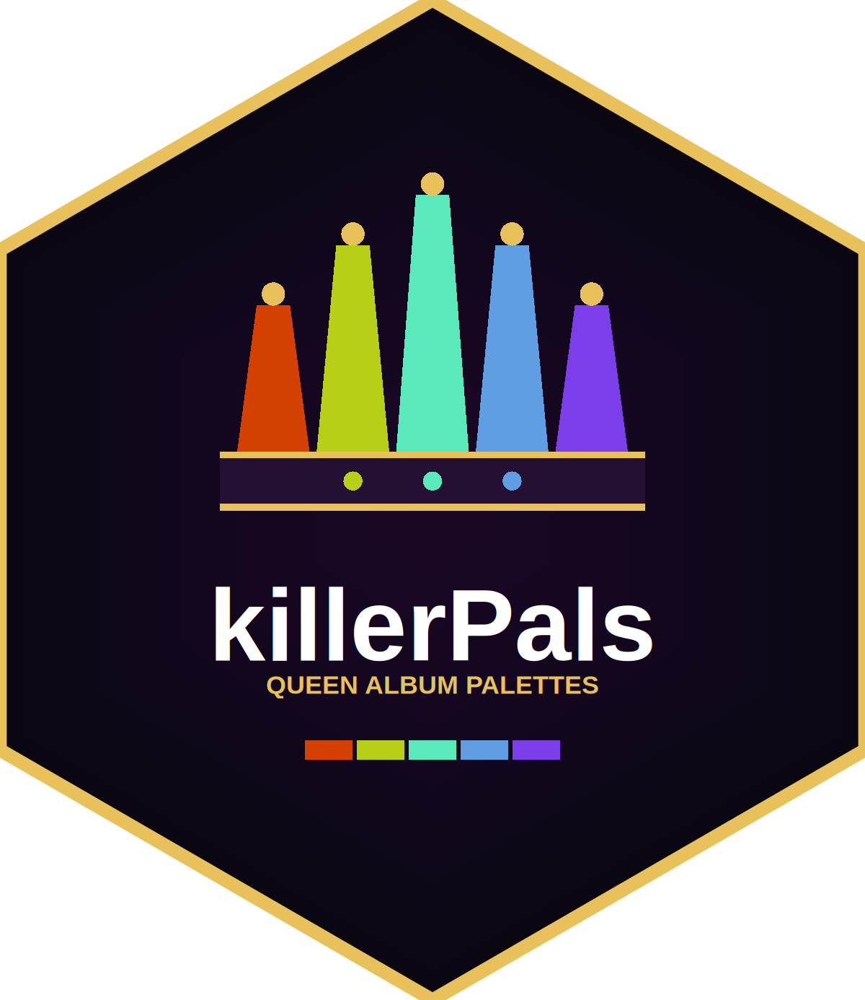
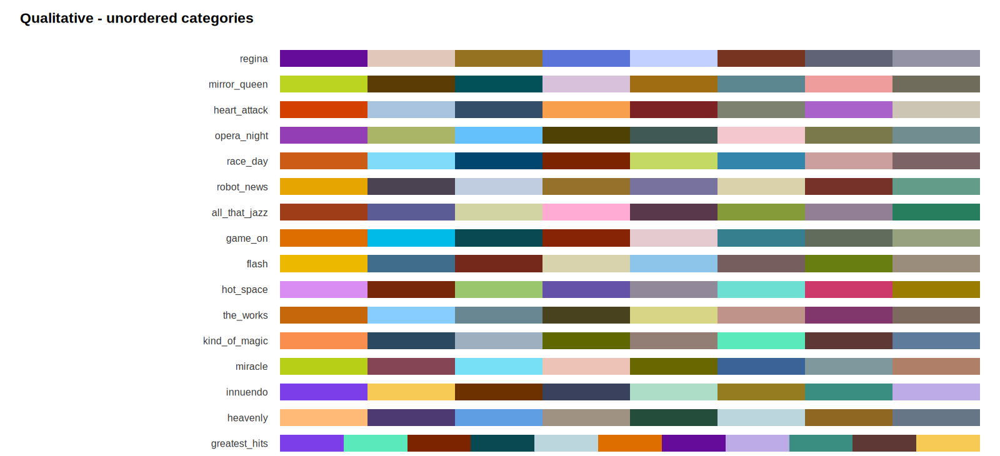
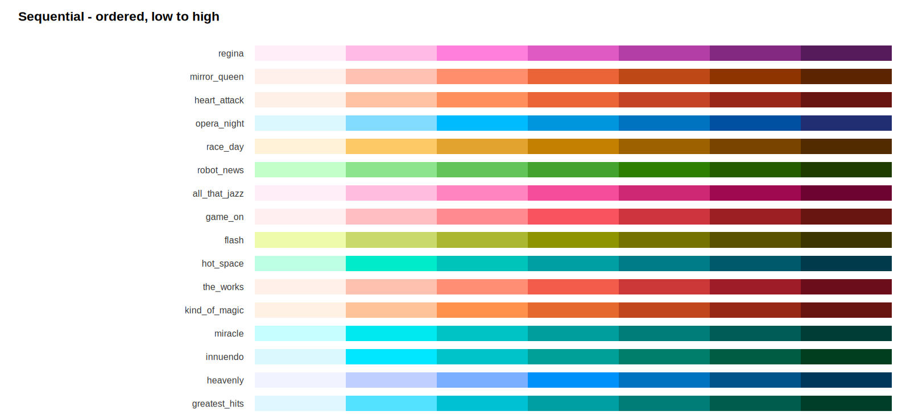
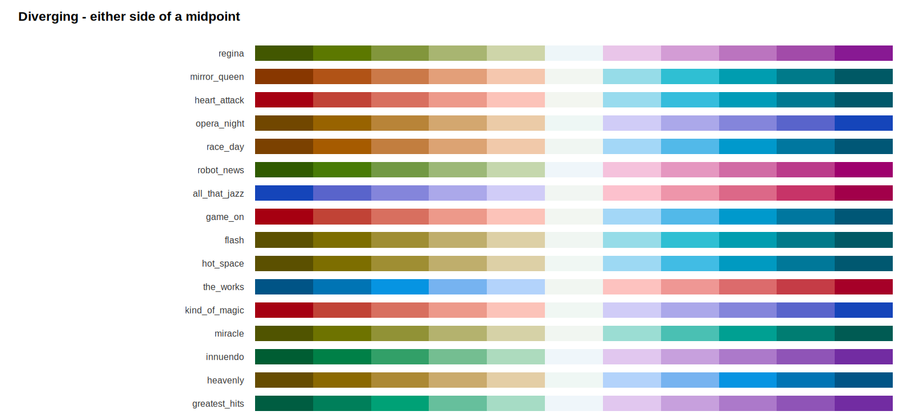
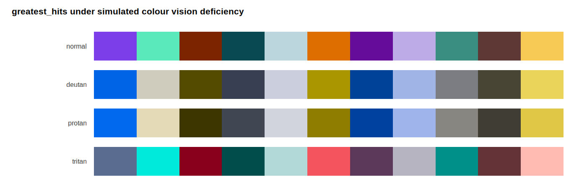

<!-- README.md is generated from README.Rmd. Please edit that file, then run `make readme`. -->

```{r, include = FALSE}
knitr::opts_chunk$set(
  collapse = TRUE,
  comment = "#>",
  fig.path = "man/figures/README-",
  out.width = "100%",
  dpi = 150
)
```

# killerPals 

<!-- badges: start -->
[](https://github.com/noahweidig/killerpals/actions/workflows/R-CMD-check.yaml)
[](https://github.com/noahweidig/killerpals/actions/workflows/pkgdown.yaml)
[](https://app.codecov.io/gh/noahweidig/killerpals)
[](https://lifecycle.r-lib.org/articles/stages.html#experimental)
[](https://opensource.org/licenses/MIT)
<!-- badges: end -->

**48 colour palettes derived from the fifteen Queen studio album covers** — a
qualitative, a sequential and a diverging palette for every album, plus a
`greatest_hits` set drawn from the whole catalogue.

Every palette is built to be *used*, not just admired:

- **Colourblind-friendly.** Colours are chosen by an optimiser that maximises
  the worst-case [CIEDE2000](https://doi.org/10.1002/col.20070) separation under
  simulated deuteranopic, protanopic and tritanopic vision — not by eyeballing a
  cover and hoping.
- **Contrast-friendly.** Every qualitative swatch clears the WCAG 2.2 3:1
  non-text contrast minimum against white *or* black, so palettes work on light
  and dark backgrounds.
- **Greyscale-safe.** Sequential ramps are strictly monotone in lightness and
  diverging ramps are monotone within each arm, so they survive being printed in
  black and white.
- **Checkable.** `killer_check()` reports the numbers, so you never have to take
  the claims on trust.

## Installation

```r
# install.packages("pak")
pak::pak("noahweidig/killerpals")
```

## Quick start

```{r quickstart, eval = FALSE}
library(killerPals)
library(ggplot2)

ggplot(mpg, aes(displ, hwy, colour = class)) +
  geom_point(size = 2) +
  scale_colour_killer_d("greatest_hits")
```

```{r example-discrete, echo = FALSE, fig.height = 3.2, fig.width = 7}
library(killerPals)
library(ggplot2)

ggplot(mpg, aes(displ, hwy, colour = class)) +
  geom_point(size = 2) +
  scale_colour_killer_d("greatest_hits") +
  labs(title = "scale_colour_killer_d(\"greatest_hits\")",
       x = "Displacement (l)", y = "Highway mpg", colour = NULL) +
  theme_minimal(base_size = 11)
```

The scale suffixes follow ggplot2's own convention:

| Suffix | Scale | Default palette type |
|---|---|---|
| `_d` | **d**iscrete | `qualitative` |
| `_c` | **c**ontinuous | `sequential` |
| `_b` | **b**inned | `sequential` |

…each in `scale_colour_*` and `scale_fill_*` form, with `scale_color_*`
aliases.

```{r example-continuous, echo = FALSE, fig.height = 3, fig.width = 7}
ggplot(faithfuld, aes(waiting, eruptions, fill = density)) +
  geom_raster() +
  scale_fill_killer_c("heavenly") +
  labs(title = "scale_fill_killer_c(\"heavenly\")") +
  theme_minimal(base_size = 11)
```

For values either side of a meaningful midpoint, ask for the diverging type and
say where the midpoint is:

```{r example-diverging, echo = FALSE, fig.height = 3, fig.width = 7}
set.seed(1975)
d <- expand.grid(x = 1:20, y = 1:20)
d$z <- as.vector(scale(outer(1:20, 1:20, function(a, b) sin(a / 3) * cos(b / 4))))

ggplot(d, aes(x, y, fill = z)) +
  geom_raster() +
  scale_fill_killer_c("innuendo", type = "diverging",
                      limits = c(-2.2, 2.2)) +
  labs(title = "scale_fill_killer_c(\"innuendo\", type = \"diverging\")") +
  theme_minimal(base_size = 11)
```

## The palettes

Palette names nod to the album they come from — `flash` for *Flash Gordon*,
`opera_night` for *A Night at the Opera*, `robot_news` for *News of the World*.

```{r info}
library(killerPals)

killer_names()
```

```{r info-table}
head(killer_palette_info(type = "qualitative"), 4)
```

### Qualitative — unordered categories



### Sequential — ordered, low to high



### Diverging — either side of a midpoint



## Using the colours directly

```{r direct}
killer_pal("flash")

# Ramps interpolate to any length, through CIELAB
killer_pal("heavenly", n = 5, type = "sequential")

# Reverse with direction = -1
killer_pal("innuendo", n = 5, type = "diverging", direction = -1)
```

## Checking the accessibility claims

Don't trust the README — run the audit:

```{r check}
killer_check("greatest_hits")
```

`min_distance` is the worst-case CIEDE2000 gap between *any two* colours in the
palette, under each vision type. Roughly speaking, 1 is the smallest difference
a person can detect and 10 is comfortably distinguishable at a glance.

You can see the same thing:

```{r cvd-plot, eval = FALSE}
killer_cvd_grid("greatest_hits")
```



`killer_check()` works on any colours at all, so you can audit palettes that
have nothing to do with this package. Here is `rainbow(8)`, the classic example
of a palette that falls apart for red-green colourblind readers, next to a
killerPals palette of the same size:

```{r check-other}
min(killer_check(colours = grDevices::rainbow(8))$min_distance)

min(killer_check("flash")$min_distance)
```

## How the palettes were derived

`data-raw/build_palettes.py` does the work:

1. Each cover is quantised in CIELAB with k-means to get candidate colours,
   weighted by how much of the cover they occupy and by how colourful they are,
   so foreground artwork beats background paper.
2. **Qualitative** palettes greedily pick the most separable candidates, then
   refine each swatch *within a bounded neighbourhood of its seed* — so the
   palette stays recognisably tied to the album art while the optimiser pushes
   the worst-case colourblind separation up.
3. **Sequential** ramps are built on each album's *distinctive* hue: the hue it
   has more of than the catalogue average. Picking the merely dominant hue made
   almost every ramp orange, because so many of these covers are sepia or
   warm-lit.
4. **Diverging** palettes use a hue pair that stays separable under every
   simulated vision type, measured at the geometry the dark arm endpoints
   actually use.

Reproduce it end to end with:

```sh
make palettes   # download covers, re-derive, rebuild data/
make all        # ...plus document, test and re-render the swatches
```

## A note on the album covers

The covers are copyrighted artwork. This package does **not** redistribute them:
they are downloaded locally by `data-raw/download_covers.py`, read only as input
to the colour derivation, and git-ignored. What ships is colour values and
swatch images generated by this package — colours themselves are not
copyrightable.

killerPals is an unofficial, non-commercial tribute. It is not affiliated with,
endorsed by, or connected to Queen, their members, or their rights holders.
Queen's crest is a trademark of its owners and is not reproduced here; the hex
logo is an original design.

## Related work

If you want palettes with different priorities: [viridis](https://sjmgarnier.github.io/viridis/)
for perceptual uniformity above all, [RColorBrewer](https://colorbrewer2.org/)
for the classic cartographic sets, [paletteer](https://emilhvitfeldt.github.io/paletteer/)
for a catalogue of nearly everything.

## Code of Conduct

Please note that this project is released with a
[Contributor Code of Conduct](CODE_OF_CONDUCT.md). By contributing, you agree to
abide by its terms.
