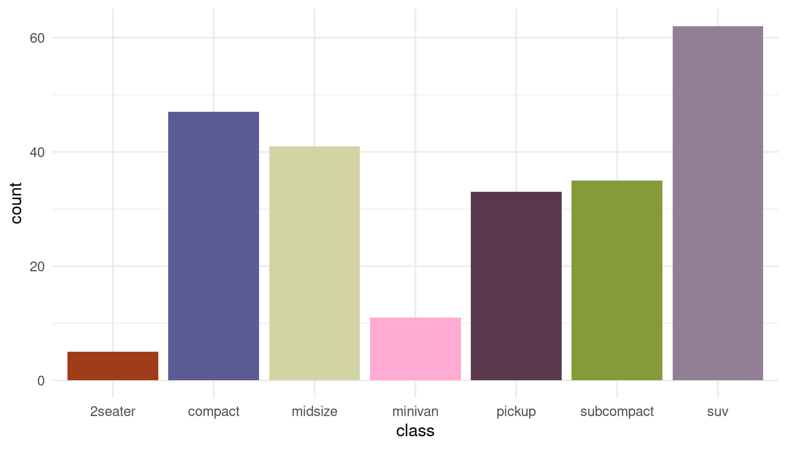
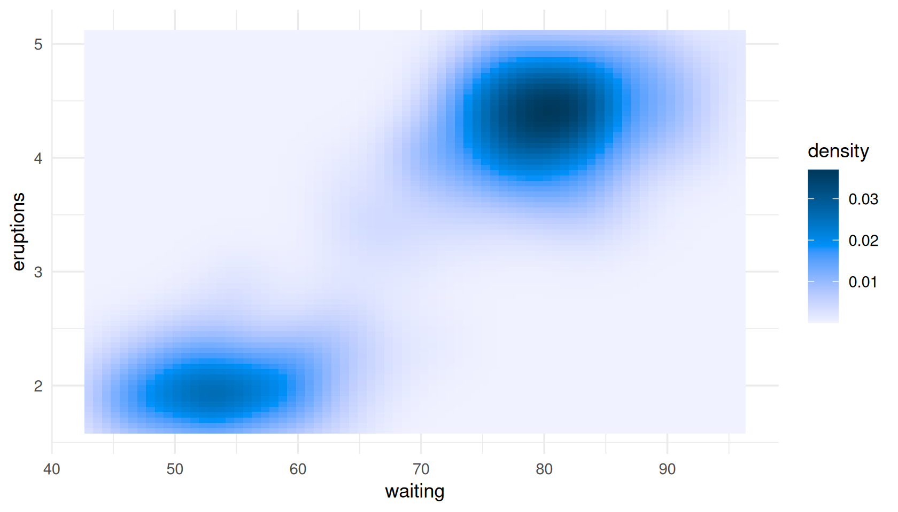
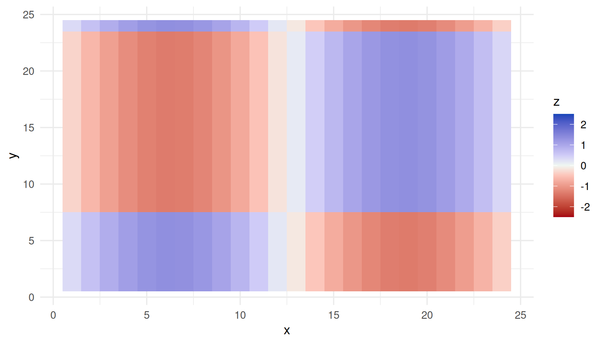
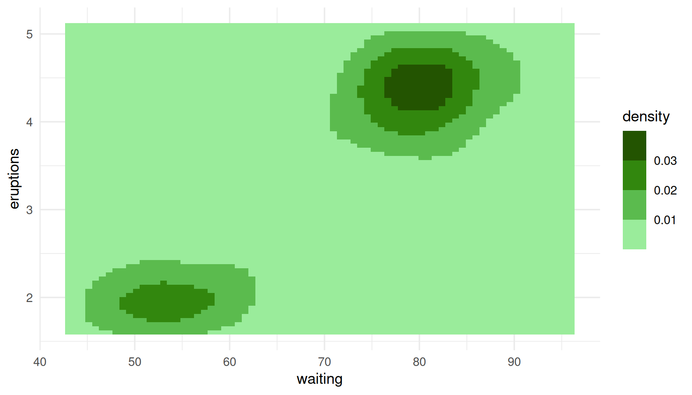
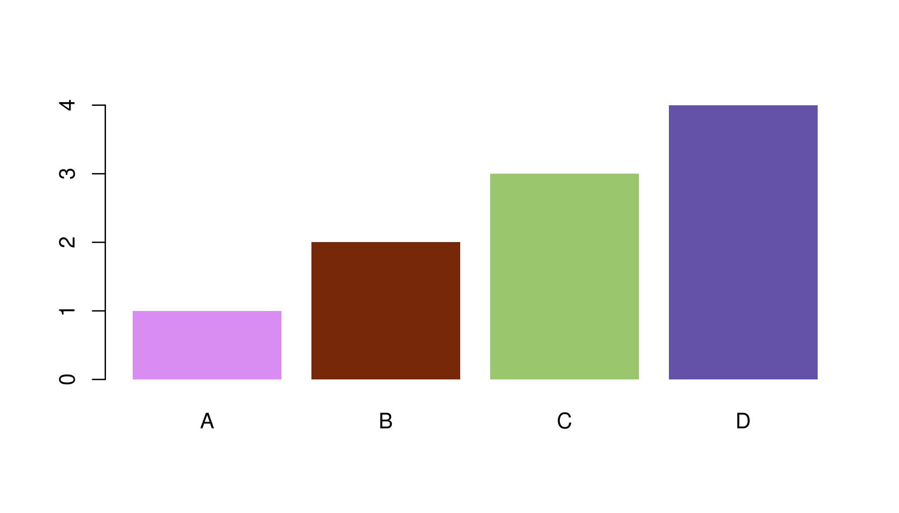
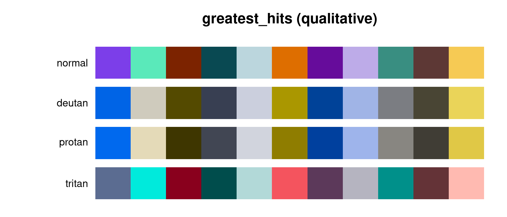
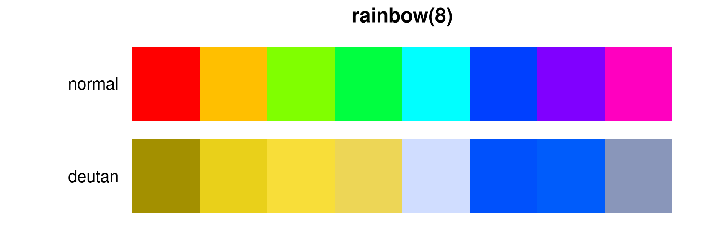

# Getting started with killerPals

``` r

library(killerPals)
library(ggplot2)
```

killerPals ships 48 palettes: a qualitative, a sequential and a
diverging palette for each of Queen’s fifteen studio albums, plus a
`greatest_hits` family drawn from the whole catalogue.

``` r

killer_names()
#>  [1] "regina"        "mirror_queen"  "heart_attack"  "opera_night"  
#>  [5] "race_day"      "robot_news"    "all_that_jazz" "game_on"      
#>  [9] "flash"         "hot_space"     "the_works"     "kind_of_magic"
#> [13] "miracle"       "innuendo"      "heavenly"      "greatest_hits"
```

## Picking a palette type

The single most common mistake in colour choice is using the wrong
*type* of palette for the data. killerPals makes the three types
explicit:

| Your variable | Palette type | Scale |
|----|----|----|
| Unordered categories (species, country, treatment) | `qualitative` | `scale_*_killer_d()` |
| Ordered, low to high (count, density, temperature) | `sequential` | `scale_*_killer_c()` |
| Spread either side of a meaningful zero (change, residual, anomaly) | `diverging` | `scale_*_killer_c(type = "diverging")` |

### Qualitative

``` r

ggplot(mpg, aes(class, fill = class)) +
  geom_bar() +
  scale_fill_killer_d("all_that_jazz") +
  theme_minimal() +
  theme(legend.position = "none")
```



Qualitative palettes deliberately refuse to invent extra colours. Asking
for more than the palette defines is an error, not a silent
interpolation, because interpolating between colourblind-safe colours
produces colours that are not:

``` r

killer_pal("flash", n = 12)
#> Error:
#> ! Palette "flash" defines 8 qualitative colours; 12 requested.
#> Use `type = "sequential"` for an interpolated ramp, or pick a palette with more colours (see `killer_palette_info()`).
```

If you genuinely have a dozen categories, use `greatest_hits` — the
largest qualitative palette — or reconsider whether twelve colours will
communicate anything at all.

``` r

length(killer_pal("greatest_hits"))
#> [1] 11
```

### Sequential

``` r

ggplot(faithfuld, aes(waiting, eruptions, fill = density)) +
  geom_raster() +
  scale_fill_killer_c("heavenly") +
  theme_minimal()
```



Every sequential ramp is strictly monotone in lightness, which is what
makes it readable in greyscale and for readers with any kind of colour
vision:

``` r

killer_check("heavenly", n = 9, type = "sequential")$monotone_lightness
#> [1] TRUE
```

### Diverging

A diverging palette says “this value is above or below a reference
point”. That only works if the palette’s light midpoint actually sits at
that reference point, so **set symmetric `limits`**:

``` r

set.seed(1975)
d <- expand.grid(x = 1:24, y = 1:24)
d$z <- as.vector(scale(outer(1:24, 1:24, function(a, b) sin(a / 4) * cos(b / 5))))

ggplot(d, aes(x, y, fill = z)) +
  geom_raster() +
  scale_fill_killer_c("kind_of_magic", type = "diverging",
                      limits = c(-2.5, 2.5)) +
  theme_minimal()
```



Leave the limits off and killerPals will remind you, because the default
range is whatever your data happens to span — which will silently put
the midpoint somewhere meaningless:

``` r

p <- ggplot(d, aes(x, y, fill = z)) +
  geom_raster() +
  scale_fill_killer_c("kind_of_magic", type = "diverging")
#> killerPals: diverging scales assume the palette midpoint is the centre of the data range.
#>   Set symmetric `limits`, or a `rescaler`, to pin the midpoint where you mean it.
```

### Binned

Binned scales cut a continuous variable into discrete steps, which often
reads more clearly than a smooth gradient:

``` r

ggplot(faithfuld, aes(waiting, eruptions, fill = density)) +
  geom_raster() +
  scale_fill_killer_b("robot_news", n.breaks = 6) +
  theme_minimal()
```



## Using colours outside ggplot2

[`killer_pal()`](https://noahweidig.github.io/killerpals/reference/killer_pal.md)
returns plain hex strings, so the palettes work anywhere.

``` r

pal <- killer_pal("hot_space", n = 4)
pal
#> <killer_palette> hot_space (qualitative, 4 colours)
#>   Hot Space (1982) - Four flat pop-art blocks - the most graphic cover they made.
#>   #D98DF2 #772809 #9AC66D #6452A9

barplot(1:4, col = pal, border = NA, names.arg = LETTERS[1:4])
```



Sequential and diverging palettes interpolate through CIELAB to any
length you ask for:

``` r

killer_pal("miracle", n = 3, type = "sequential")
#> <killer_palette> miracle (sequential, 3 colours)
#>   The Miracle (1989) - Four faces morphed into one, in cold studio light.
#>   #C5FEFF #009F9E #003D37
killer_pal("miracle", n = 11, type = "sequential")
#> <killer_palette> miracle (sequential, 11 colours)
#>   The Miracle (1989) - Four faces morphed into one, in cold studio light.
#>   #C5FEFF #5AF3FB #00E1E8 #00CACE #0CB4B5 #009F9E #008A87 #007671 #00625C #004F49 #003D37
```

For code that needs a palette *function* — the shape ggplot2 and scales
expect — use
[`killer_pal_fun()`](https://noahweidig.github.io/killerpals/reference/killer_pal_fun.md):

``` r

f <- killer_pal_fun("innuendo", type = "diverging")
f(5)
#> [1] "#005D33" "#54AF7C" "#EEF6F9" "#B98CD3" "#722CA1"
```

## Auditing accessibility

The package’s central claim is that these palettes stay legible for
colourblind readers.
[`killer_check()`](https://noahweidig.github.io/killerpals/reference/killer_check.md)
lets you verify that rather than trust it.

``` r

killer_check("greatest_hits")
#> <killer_check> greatest_hits (qualitative) 
#>   colours: 11 
#>   worst-case CIEDE2000 separation by vision type:
#>     normal    14.6
#>     deutan    13.3
#>     protan    12.7
#>     tritan    12.5
#>   contrast vs white: 1.52 - 10.08
#>   contrast vs black: 2.08 - 13.80
#>   lightness (L*):    27.9 - 83.9
#>   monotone lightness: FALSE
```

`min_distance` is the smallest
[CIEDE2000](https://doi.org/10.1002/col.20070) difference between *any
two* colours in the palette, recomputed after simulating each kind of
colour vision deficiency. As a rule of thumb, a difference of 1 is the
smallest a person can detect at all, and 10 is comfortably
distinguishable at a glance.

To see it rather than read it:

``` r

killer_cvd_grid("greatest_hits")
```



Compare that with a palette built without any of this in mind:

``` r

rb <- grDevices::rainbow(8)
op <- par(mar = c(0.5, 5.5, 1.5, 0.5))
plot(c(0, 8), c(0, 2), type = "n", axes = FALSE, xlab = "", ylab = "",
     main = "rainbow(8)")
rect(0:7, 1.1, 1:8, 1.9, col = rb, border = NA)
rect(0:7, 0.1, 1:8, 0.9, col = killer_cvd(rb, "deutan"), border = NA)
text(c(-0.2, -0.2), c(1.5, 0.5), c("normal", "deutan"), adj = 1, xpd = NA)
```



``` r

par(op)

min(killer_check(colours = rb)$min_distance)
#> [1] 0.9610308
```

Two of those eight colours are essentially identical to a deuteranopic
reader. Every killerPals qualitative palette keeps its worst pair above
10, and the per-album palettes above 15:

``` r

worst <- vapply(killer_names(), function(nm) {
  min(killer_check(nm)$min_distance)
}, numeric(1))
round(sort(worst), 1)
#> greatest_hits     the_works     hot_space all_that_jazz         flash 
#>          12.5          16.0          16.2          16.8          17.3 
#>  mirror_queen       miracle       game_on kind_of_magic        regina 
#>          17.4          17.6          17.8          17.8          18.0 
#>    robot_news      heavenly  heart_attack   opera_night      race_day 
#>          18.1          18.4          18.4          19.1          20.3 
#>      innuendo 
#>          21.1
```

## The individual metrics

The building blocks are exported too, and work on any colours:

``` r

# Perceptual difference
killer_distance("#FF0000", "#FF3300")
#> [1] 3.585222

# WCAG contrast ratio, and relative luminance
killer_contrast("#FF524F", "white")
#> [1] 3.195462
killer_luminance(c("white", "grey50", "black"))
#> [1] 1.0000000 0.2122308 0.0000000

# Which pair in a palette is the weakest link?
m <- killer_distance_matrix(killer_pal("flash"), cvd = "deutan")
round(min(m, na.rm = TRUE), 1)
#> [1] 17.3
```

## Choosing between palettes

[`killer_palette_info()`](https://noahweidig.github.io/killerpals/reference/killer_palette_info.md)
gives a tidy overview, including each palette’s blurb:

``` r

info <- killer_palette_info(type = "qualitative")
info[order(-info$n), c("name", "album", "year", "n")][1:5, ]
#>             name                album year  n
#> 16 greatest_hits        Greatest Hits 1981 11
#> 1         regina                Queen 1973  8
#> 3   heart_attack   Sheer Heart Attack 1974  8
#> 2   mirror_queen             Queen II 1974  8
#> 4    opera_night A Night at the Opera 1975  8
```

``` r

cat(paste0(format(info$name, width = 15), info$blurb), sep = "\n")
#> regina         Smoke, spotlight and stage-purple from the 1973 debut.
#> heart_attack   Oiled, exhausted and lit in sickly green - the 1974 pile-up.
#> mirror_queen   The mirrored Mick Rock portrait: side White against side Black.
#> opera_night    Heraldic crest colours: cream, gilt and deep operatic red.
#> race_day       The crest again, inverted - black lacquer and silver.
#> robot_news     Frank Kelly Freas's robot: pulp-magazine blues and steel.
#> all_that_jazz  Berlin Wall stencil geometry in flat, graphic primaries.
#> flash          Ah-ah! Saviour of the universe: comic-strip red, gold and void.
#> game_on        Chrome, leather and cool monochrome with a flash of colour.
#> greatest_hits  The most separable colours from all fifteen studio covers.
#> hot_space      Four flat pop-art blocks - the most graphic cover they made.
#> the_works      George Hurrell's Hollywood monochrome, warmed by sepia light.
#> kind_of_magic  Roger Chiasson's cartoon night sky: neon over midnight blue.
#> miracle        Four faces morphed into one, in cold studio light.
#> innuendo       Grandville's Victorian engraving, hand-tinted and ornate.
#> heavenly       Montreux at dusk: lake blue, alpine grey and the last light.
```
